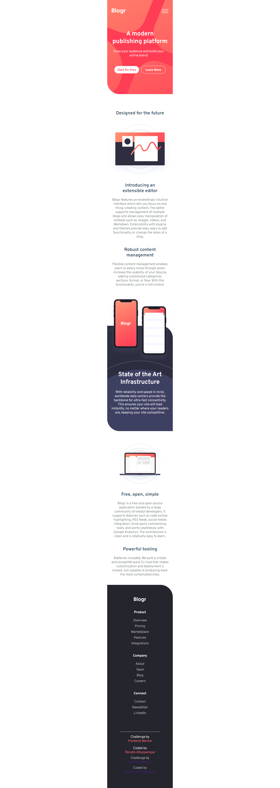
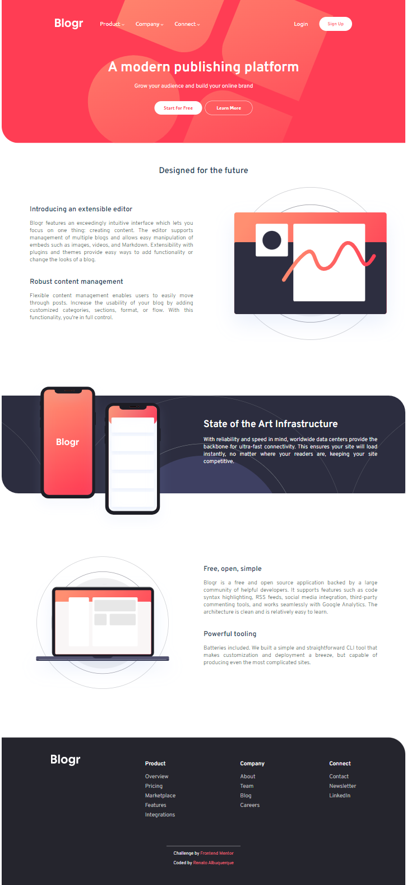

# Blogr landing page solution - Frontend Mentor

This is a solution to the [Blogr landing page challenge on Frontend Mentor](https://www.frontendmentor.io/challenges/blogr-landing-page-EX2RLAApP). Frontend Mentor challenges help you improve your coding skills by building realistic projects.  

## Table of contents

- [Overview](#overview)
  - [The challenge](#the-challenge)
  - [Screenshot](#screenshot)
  - [Links](#links)
- [My process](#my-process)
  - [Built with](#built-with)
- [Author](#author)

## Overview

### The challenge

Users should be able to:

- View the optimal layout for the site depending on their device's screen size
- See hover states for all interactive elements on the page

### Screenshot

### Links

- [Solution URL here](https://github.com/renato-albuquerque/blogr-landing-page)
- [Live Site URL here](https://renato-albuquerque.github.io/blogr-landing-page/)

## My process

### Built with

- Semantic HTML5 markup
- CSS custom properties
- Flexbox
- JavaScript
- Mobile-first workflow

## Author

- Business Card - [Renato Albuquerque](https://portfolio-renatoalbuquerque.vercel.app/)
- Linkedin - [renato-malbuquerque](https://www.linkedin.com/in/renato-malbuquerque/)
- Discord - [Renato Albuquerque#0025](https://discordapp.com/users/992621595547938837)
- Frontend Mentor - [@renato-albuquerque](https://www.frontendmentor.io/profile/renato-albuquerque)